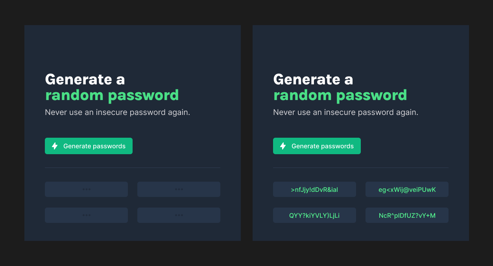
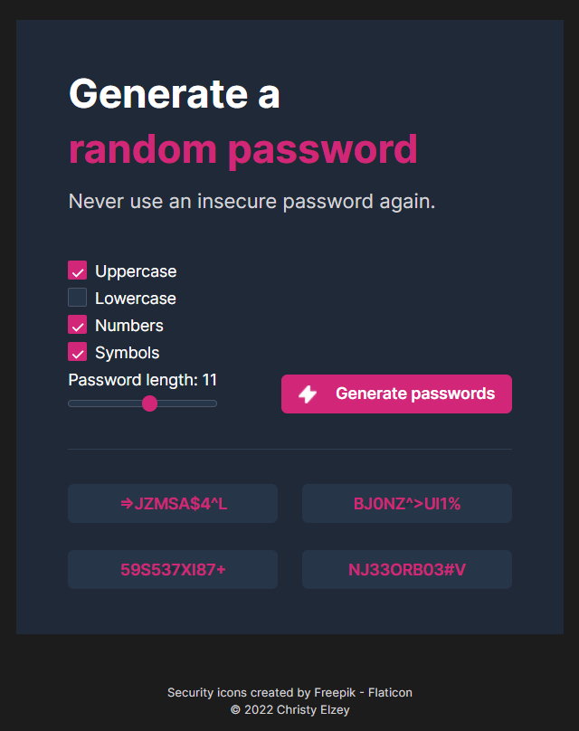
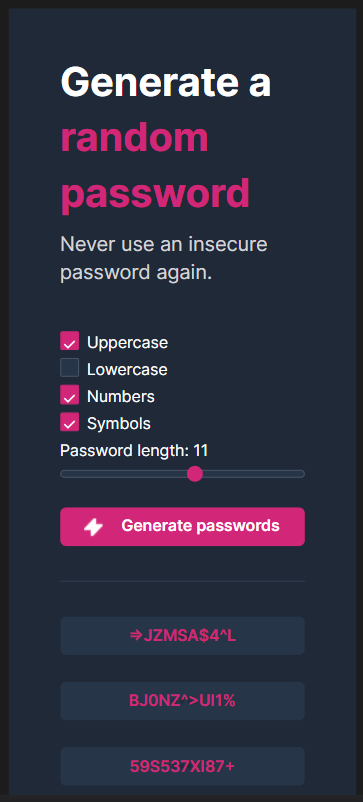

# Scrimba Frontend Developer Career Path - Password generator solo project

This is a solution to the [Scrimba FDCP - Module 3.4 Solo Project: Password Generator](https://www.figma.com/file/YRO9Iw5IYaOorjnRyNz4bV/Random-Password-Generator?node-id=0%3A1). Scrimba Solo Projects challenges you improve your coding skills by building realistic projects.

## Table of contents

- [Overview](#overview)
  - [The challenge](#the-challenge)
  - [Screenshots](#screenshots)
  - [Links](#links)
- [My process](#my-process)
  - [Built with](#built-with)
  - [What I learned](#what-i-learned)
  - [Continued development](#continued-development)
  - [Useful resources](#useful-resources)
- [Author](#author)
- [Acknowledgments](#acknowledgments)


## Overview

### The challenge

Requirements:

- Array to hold all possible characters
- Button to generate 4 random password options
- Display password options
- Stretch: ability to set the password length
- Stretch: 1-click copy password to the clip board




### Screenshots

My solution:






### Links

- Solution URL: [GitHub Repository](https://github.com/clelzey/password-generator)
- Live Site URL: [GitHub Page](https://clelzey.github.io/password-generator/)

## My process

### Built with

- Semantic HTML5 markup
- CSS custom properties
- Flexbox
- CSS Grid

### What I learned

I used this project to solidify my learning in CSS Grid and Flexbox. I also wanted to try new thing by including
checkbox and slider inputs. I used the Password Generator by [Last Pass](https://www.lastpass.com/features/password-generator)
as inspiration for the functionality of the application.

Before this project I did not know how difficult it is to style a checkbox input. I was very surprised at how much css is
required to override the default style.

How to create a simple snackbar to notify the user of an action, in this application the action is the password being copied
to the clipboard. The snackbar topped off the new design elements implemented in the application.

I am proud of how using CSS Grid for the area where the generated passwords would be displayed allowed me to keep the HTML markup
very flat.

```html
<div class="generator__passwords">
  <input class="generator__passwords_password password_area" type="text" id="pw_el_1">
  <input class="generator__passwords_password password_area" type="text" id="pw_el_2">
  <input class="generator__passwords_password password_area" type="text" id="pw_el_3">
  <input class="generator__passwords_password password_area" type="text" id="pw_el_4">
</div>
```

The event listener added to the button for generating a password is very efficient at creating the text for each of the
password areas. In the future I would like to refactor this to use `.forEach()` to assign the passwords, further reducing
the amount of code.

```js
genPwEl.addEventListener('click', () => {
  checkboxErrorEl.textContent = ""
  let passwordChars = ""
  passwordChars = buildChars(passwordChars)
  passwordChars = passwordChars.split("")
  const passwordLength = lengthEl.value

  pwEl1.value = createPassword(passwordChars, passwordLength)
  pwEl2.value = createPassword(passwordChars, passwordLength)
  pwEl3.value = createPassword(passwordChars, passwordLength)
  pwEl4.value = createPassword(passwordChars, passwordLength)
})
```

### Continued development

Beside using `.forEach()` to reduce the JS needed for the eventListener to assign the randomly generated passwords. I plan
to replace the series of `if` statements used to build the characters for the password with a `switch` statement.

### Useful resources

- [Kallmanation - Styling a checkbox with only CSS](https://www.kallmanation.com/styling-a-checkbox-with-only-css) - I
used this resource to style the checkboxes.
- [W3 schools - How TO - Snackbar / Toast](https://www.w3schools.com/howto/howto_js_snackbar.asp) - This resource was used
to create the snackbar notice when passwords are copied to the clipboard.
- [W3 schools - How TO - Range Slicers](https://www.w3schools.com/howto/howto_js_rangeslider.asp) - This resource was used
to create the range slider and its connection to the label used on the page.

## Author

- Website - [Christy Elzey](https://clelzey.github.io/digital-business-card/)
- GitHub - [@clelzey](https://github.com/clelzey/)
- Twitter - [@codeMuse2](https://twitter.com/codeMuse2)


## Acknowledgments

Thanks to the amazing teachers over at [Scrimba](https://scrimba.com/), their courses have been incredible in teaching
me the skills needed to complete this solo project. The Frontend Developer Career Path has so much content. It is constantly
updated with new challenges and current information. Definitely worth the Pro Membership.

### Supporting Scrimba

Since 2017, we have created over 20 free courses on Scrimba, and we're going to
continue launching free courses. But to pay our bills, we have to charge once
in a while. So if you've ever wanted to "give back" to Scrimba, you can do that by buying
one of our paid courses

- [Become a professional React developer](https://scrimba.com/course/greact)
- [The Responsive Web Design Bootcamp](https://scrimba.com/course/gresponsive)
- [The Ultimate JavaScript Bootcamp](https://scrimba.com/course/gjavascript)

  It would also mean the world to us if you share the courses.

Happy Coding!
